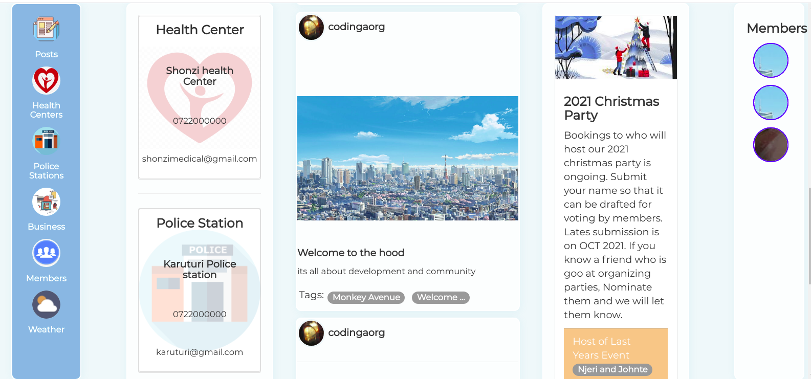

# Neighbourhood_Alert
This is a neighborhood website that enables users of a given community to interact together, by sharing posts, and neighbourhood information including police and health departments contacts.

Future releases to enable admin settings and roles assigning.

# User journey.
A user visits the site. 
|_A user Registers to the website. 
  |_A user Logs in 
    |__A user sees all posts shared on the homepage. 
    |__A user searches for a other area business 
    |_A user can create post 
    |_A user can open profile to view profile 
      |_A user can update profile 
    |_A user sees their own posts 
    |_A user can add posts 
    |_A user can change neighborhood when they move out 
  |-A user logs out and is redirected to login 

# Features to add
admin settings and roles assigning

# Output
A user sees posts its details.

A searches for business

# Homepage

# Business Details

# Posts

# Search results page

# Update Neighborhood

# user profile

# Installation
For correct version requirements installation, check the requirements.txt

Have Python installed in you machine.- the version used for this project is 3.8.5

install pip

install and activate virtual environment

install flask in the virtual environment < version used flask1.0.2 >

Use git, Github and any editor or IDE to see the codes and the rendered frontend.

The execution is done in terminal. Either computer Terminal or IDE terminal

# Usage
Ensure you have Python installed in your machine. Clone this github repository, git pull to your local machine and code away.

# Contributing
Pull requests are welcome. For major changes, please open an issue first to discuss what you would like to change.

Please make sure to update tests as appropriate.

# Website's link
This aplication is hosted heroku. Website Link is https://hoodalert.herokuapp.com/

# License
This Website uses MIT LICENSE. For more Read License.

Copyright (c) 2021 Caleb Odinga